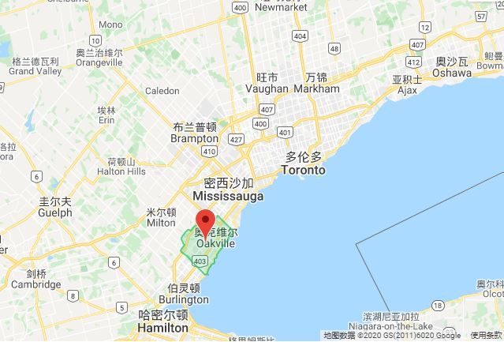
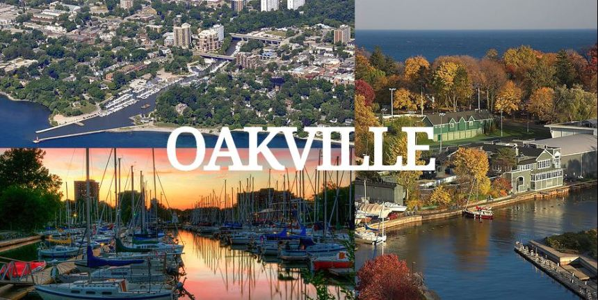

Oakville 隶属Halton 地区，是大多伦多地区的一部分。 Oakville在大多地区的西部，南临安大略湖，北接Milton，东面是密西沙加，西面是Burlinton，常住人口193,832 (2016 年统计），人口结构比较年轻。经常被评为加拿大最宜居的城市之一

奥克维尔拥有无敌的湖景，可远眺晨曦升腾多伦多海市蜃楼般的城市风景；亦可欣赏天涯日落绚丽壮美的漫天彩霞。市内大型省级公园及各类型小公园遍布，总面积达1420公顷，包括140公里长的森林小径和众多的高尔夫球场，每个公园提供不同的活动设施，包括滑板公园，游泳池，足球场，网球场，篮球场等。因其得天独厚的靠湖地理位置，Oakville受益于湖泊的天气效应，冬季相对温和，夏季也比较凉爽。

人们热衷于各种户外活动并享受其中，包括高尔夫球，网球，帆船，骑自行车，园艺和徒步旅行等，著名的Glen Abbey国际高尔夫俱乐部每两年举办一次加拿大公开赛，为城中盛事之一。邻近的冬季运动场所，也为人们喜爱的冬季运动包括冰球，滑雪和冰壶提供了极大的便利。

相对于其他地区，Oakville 的人口构成以欧洲裔为主，约占全市人口的80%, 欧洲文化对当地的人文环境产生很大影响。Oakville是加拿大著名的富裕城市， 人均收入常年排名加拿大的前五位。Oakville不仅环境优美，风景如画，而且经济发达，很多世界闻名的大公司，比如福特汽车公司加拿大分公司的总部和快餐连锁店Tim Hortons的总部皆坐落于此。