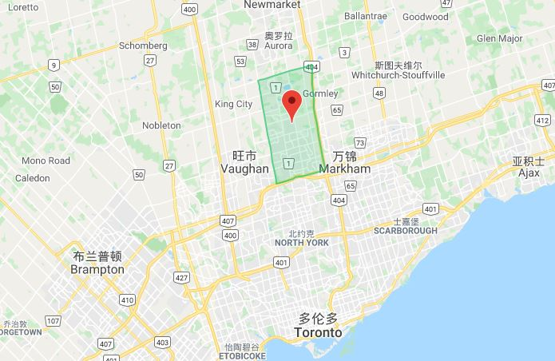

Richmond Hill 列治文山，是大多伦多地区的一个部分，仅距多伦多的北约克5公里，距多伦多市中心20公里。至2020年,列治文山人口为22万。

### 历史沿革

Richmond Hill这个城市的名字来源于英国Richmond公爵于1819年访问过这个地区。至今的市徽还采用Richmond公爵的带狮子的徽章。因为这个城市的地势比周围的地区都要高，从这个城市发源的不少小溪小河向南汇入Rouge River, Don River, Humber River，流向Lake Ontario（安大略湖），向北汇入East Holland River 流向Lake Simcoe（闪高湖）。

Richmond Hill早在1800年代早期就有欧洲的先民在如今的Yonge Street和Major Mackenzie Drive附近定居，这个位置也就是现在的Richmond Hill的Downtown（市中心）。在一个世纪前这个城市还是乡村地区，这里曾经是加拿大最大的玫瑰花种植基地。最著名的就是Hamlet of Gormley，被政府列为文化遗产。

由于早期Richmond Hill还是乡村地带，夜晚星空十分明亮和清晰，多伦多大学于1935年在现在的16街以北和Yonge夹Bayview之间大约189英亩（76公顷）土地上设立了David Dunlap Observatory（天文观测台），里面有曾经是世界上第二大目前还是加拿大最大的天文望远镜。由于有这个天文望远镜的存在，Richmond Hill是加拿大为数很少目前仍然对光污染有管制的城市。

### 城市发展

随着人口的流入和发展，列治文山于2019年由town升级为city。 约克区（York Region，和多伦多平级的行政区域）的区域中心，位于央街和Highway 7。这片区域将会成为Richmond Hill/Langstaff 城市增长中心区域。

列治文山中心的大部分配套设施已经建成。公共设施包括Langstaff GO station（去多伦多市中心上班的城郊火车站）、约克区公共汽车枢纽以及其他的生活配套设施包括商场、超市、学校、图书馆、政府服务等。当然这附近也少不了住宅楼房（主要是Condo）。

优越的地理位置、交通便利和居住着较多受过高等教育的居民，其经济发展在大多伦多地区名列前茅，形成了以金融保险、科技、专业服务、批发零售、制造业、和信息和文化产业等为龙头的产业，不少知名公司如大名鼎鼎的高通公司和著名晶片生产企业AMD的加拿大总部就在列治文山。

### 环境保护

列治文山环境优美，安省著名Oak Ridge Moraine（橡树岭冰碛地带）经过列治文山北部。橡树岭冰碛地带是安大略省非常著名的自然遗产和绿色生态系统。这个带状山岭从东边的Trent River（川河）绵延160公里到西边的Niagara Escarpment（尼亚加悬崖）。

城市各处点缀着冰川时代留下的Kettle Lakes，例如城市北部的Wilcox Lake和Philips Lake。由于这个城市相对于周围城市地势高，不少河流发源于此，流向周边的Lake Ontario（安大略湖）和Lake Simco（闪高湖），河流流域的保护也是一个重点。

### 教育资源

Richmond Hill拥有优秀的教学资源。Bayview Hill Second School的学生被长春藤名校录取的人数在有些年份甚至超过加拿大顶级私校UTS和UCC，常年受到追捧。 另一所高中Richmond Hill High School也是在安省排名前列。

### Richmond Hill 社区

#### _South Richvale (南贵谷)_

位于列治文山的最南端，是列治文山历史最久的豪宅区。发展始于上世纪初，到40年代末，随着央街的重建，城市基础设施也逐步完善，社区陆续发展，70年代蓬勃发展，社区建成。至本世纪初，大Lot的旧屋开始翻建，大批豪宅涌现。其建筑也显现多样化，从乔治到都铎、歌德到罗马，个性十足，更融合古典与现代，精致气派，庭院花草更是独具匠心、风格各异。加拿大一流的列治文山高尔夫俱乐部及乡村俱乐部占了约社区面积的15%，东北角对面即是北美特色的Hillcrest Mall。

#### _Langstaff_

Langstaff与南贵谷隔央街东西相对，这个社区的整体风格趋于现代化。购物、交通、餐饮娱乐与南贵谷相同。该区高中属于Langstaff高中学区，小学Red Map成绩也很不错。Langstaff社区中心也是新建的，规模很大，运动场、室内健身、会议室、活动室等一应俱全。

#### _Doncrest_

Doncrest是Richmond Hill较早的规模建设的社区，其风格和年代与万锦的 The Bridle Trail相似。与东侧的商业区相连，又与南侧万锦的密集的Condo、Townhouse社区Commerce Valley相对，大量的华人商业广场、餐饮、银行、医疗等服务机构设置于此，形成Richmond Hill的华人商业中心。

#### _North Richvale (北贵谷)_

北贵谷环境优美、商业繁荣、购物交通便利、物业种类齐全，适合各收入阶层居住。

#### _Observatory_

顾名思义，就因为是多大的天文台在此而得名。该区1/3是多大的用地及天文台。小学是铁路东面的16街小学；高中是Alexander Mackienzie HS和名校Bayview SS。

#### _Harding_

Harding社区和Observatory一样只有一般社区的一半大小，铁路在中间穿行，刚好将社区分为两个自然的区域，学区也自然不同。西部央街沿线照例有很多商铺，小学是Walter Scott PS，在Crosby社区，高中是Alexander Mackenzie H.S.。东区与西区有点类似，小学也是Walter Scott PS；高中则是名校Bayview SS，举步即到；东临富豪山庄。

#### _Bayview Hill (富豪山庄)_

静谧、气派，是步入该区最大的感受，该小区相对独立，约4平房公里，大部分于80年代建造，宽阔的大道和宽大的地盘是该小区最大的特点。共有5个公园，以中心的Bayview Hill公园为最大。高中为Bayview SS，大家公认的名校，设有IB课程。

#### _Mill Pond_

社区内的ALEXANDER MACKENZIE中学注重培养学生的艺术、动手和创造能力，尤以艺术类见长，是约克郡有名的艺术类中学。

#### _Crosby_

Crosby社区地势平缓，街道规整，几十年的成熟老社区，又依傍古街，学区优秀。Crosby Heighs小学学区除了Major Mac沿线，几乎覆盖整个社区，高中则以铁路为界为两个学区，东区的Bayview SS则更受华人亲睐。

#### _Rouge Woods_

大片的溪谷，密布的公园，健身设施充分、儿童玩场遍布，有9个足球场，9个网球场。北面临着最大的公园Richmond Green；南面是富豪山庄；西面是老社区。社区分属两个公立高中，Bayview SS及Richmond Green。该区房屋有大有小，适合不同群体。

#### _Westbrook_

Westbrook是90年代后兴建的新区，自西南角开始逐步向北建设。胭脂河的源河溪谷从西北角斜穿社区至东南角，流入 Tool Bar公园，将社区一分为二。

#### _Devonsleigh_

Devonsleigh始建于80年代，大规模成型于90年代初期，19街沿线最晚开发于2000年后。社区被铁路一隔为二，东侧社区小，大小独立屋混合，冰球中心坐落于此，高中属于Richmond Green。在Bayview路上有独立私密的著名私校Holy Trinity School。西区有Loblaw超市、Leon家具广场、餐饮、购物等。

#### _Jefferson_

在谈到Jefferson社区，首先脑海里是它别致的“L”形状，而形容它的词汇便是世外桃源。这里的房屋密集度偏低，更多的是生态植被，优美峡谷。Jefferson环境优美、宽松，居民人口少，结构好、素质高；高中是Richmond Hill高中，小学Moraine Hills Public School。社区街口有购物点，Canadian Tire商场、Sobey超市、银行、餐饮等。

#### _Oak Ridges 及Oak Ridges Lake Wilcox_

这两个社区分处Yonge街东西，以前为一个独立的小镇，可以合二为一看待。1971年归入列治文山。Oak Ridges处于列治文山的最北端，与Auroa相接。中心地段及围绕风景优美的Wilcox湖是小镇的中心及主要社区。亮点是Wilcox湖区，湖不大，呈圆型，湖面开阔，碧波倒影，风景蔚然！围绕湖边是大量的豪宅，东侧是大公园，新建的社区中心，有小小的Beach、划艇俱乐部，可以烧烤野炊。是列治文山户外及水山休闲地之一。

#### _Rural Richmond Hill (列治文山田园社区)_

Rural Richmond Hill（田园社区），是最大的社区，也是居民密度最低的社区，唯一的集中居民区在Trailwood山村别墅豪宅区，其它都为农场、花圃或高尔夫球场。
