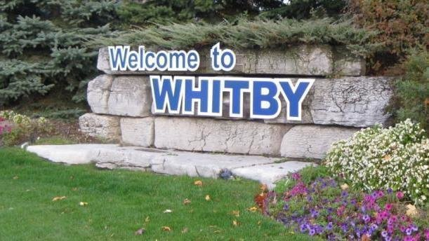
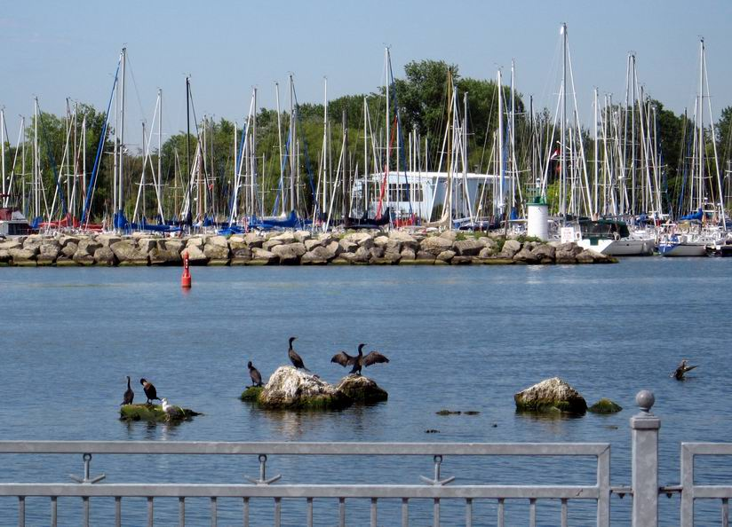

惠特比镇是Dunham地区的总部。居住在惠特比（Whitby）的人口约为10万。许多当地居民受雇于宝马汽车公司，加拿大索尼公司，李尔公司，Enbridge公司，加拿大诺华制药公司和伍德布里奇泡沫公司等公司，这些公司都设在惠特比。

Whitby拥有精心设计和负担得起的新住宅区，前往多伦多的便捷交通，美丽的海滨，备受好评的学校，繁华的市中心购物区以及出色的娱乐设施。近年来，吸引了越来越多的家庭选择在Whity置业。

