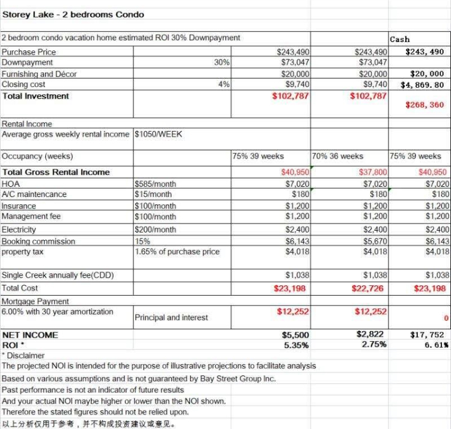



👆 上面是Windsor 5房TH的回报表

联排5房的--Windsor at westside & Champions gate，目前都有37万左右的5房TOWNHOUSE ， 回报率大概在4%-6% ， 低于独立屋， 其原因是： townhouse 比house，少了3个房价， 租金上起码差距在150一晚， 可是每月的开销费用townhouse比house少不了多少...不过Townhouse 的总投入成本低，大概在17万左右就可以了， 所以适合于不追求超高回报， 稳妥型客人，投入少， 在全部cover完费用和房贷以后还有6千-1万的现金收入

对于2-3房 的Condo---Storey Lake 和 Champions Gate 目前都有24万左右的CONDO， 回报率是最低了， 其原因也是管理费相对高，房间少租金会相对低。 不过condo是投资门槛最低的，  首付7万， 加上家具软装和交房费用， 总投入在10万美金就可以了， 这个更加适合不追求高现金流，希望自己过去住，享受生活品味的客人。 当然在您总投入10万以后， 租金是完全可以cover您的开销和贷款的， 只是现金流相对独立屋没有那么高。 

