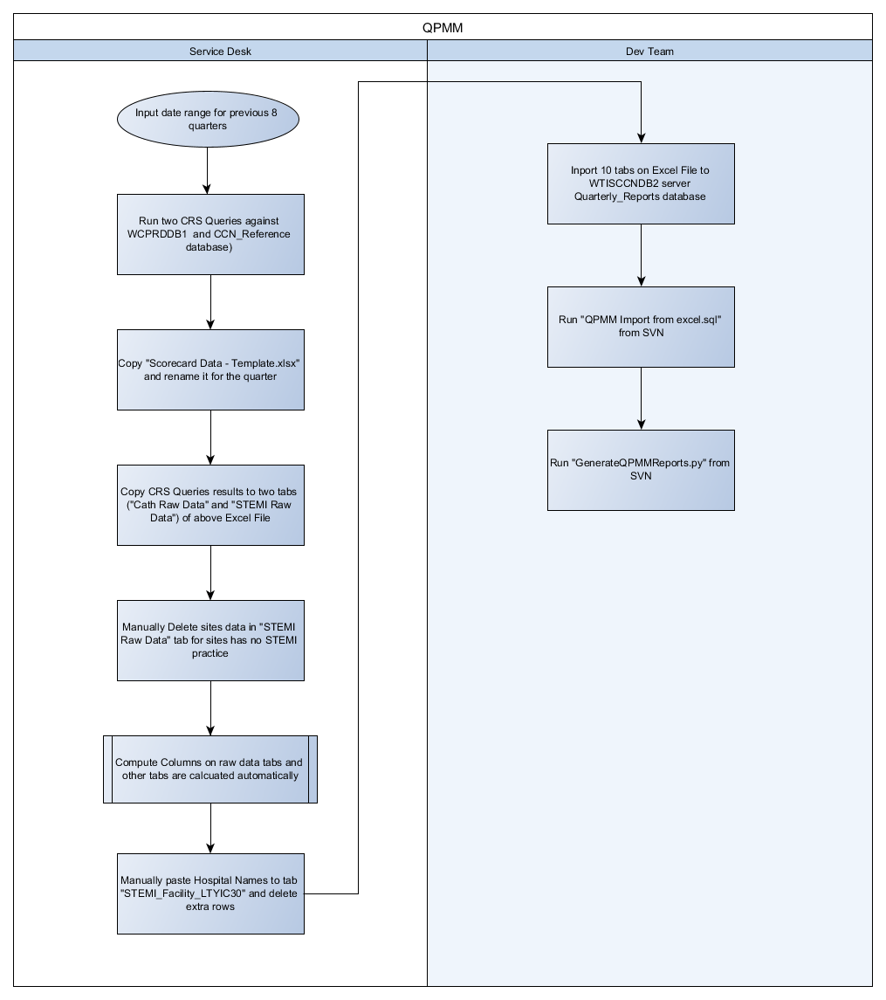

## Flow Chart

## Service Desk

1. Run two queries from CRS, input date range parameters for previous 8 quarters for the queries

	* The queries run at the 4th business day of the beginning of a quarter to generate the QPMM report for the previous quarter
	* These two queries access tables of database **WCPRDDB1** and views of database **CCN_Reference** on server WTISCCNDB2.
	Views used in CCN_Reference database

    |Database|View Name|Database Used in View| Tables used in View|
	|--|--|--|--|
	|CCN_Reference|vw_CCN_MasterEntries| WCPRDDB1 |CardiacWaitListEntry WaitTimePatient Site Facility WaitlistEntryKey VascularEntry|
	|CCN_Reference|vw_CCN_FacilitySiteRel|WCPRDDB1|FacilitySiteRel|

2. Copy "Scorecard - Template.xlsx" to target folder and rename it appropriately to match the reported quarter

    * Excel File name sample "Scorecard Data - FY1819 Q2.xlsx"

3. Copy query output in step 1 to Excel File in step 2

	* One CRS query output is copied to "Cath Raw Data" tab
	* One CRS query output is copied to "STEMI Raw Data" tab

4. Computed Columns on Excel File are calculated automatically

	|Tab | Purpose | Important Compute Columns / Notes| Inported to database Quarterly_Report?|
	|--|--|--|--|
	|Cath Raw Data| Contains CRS query output for CATH data Contains compute columns used by other compute tabs| Disease Bucket, Testing Bucket, Wait Location Please see [CATH Compute Columns Design](cardiac-specification.md#compute-columns-design) for deails|No|
	|STEMI Raw Data|Comtains CRS query output for STEMI data Contains compute columns used by other compute tabs|Grouping, Referfusion Time, Lytic Grouping, Lytic Time  Please see [STEMI Compute Columns Design](STEMI-specification.md#compute-columns-design) for details|No|
	|Quarter|Calculate the previous eight quarters' labels according to the date of today| used by compute columns on other tabs|No|
	|ScoreCardCATH_STEMI|Contains calculated data used on data region "Your Hospital Quarterly Results" on report page 1, page 2, page 3, page 4 | |Yes|
	|usp_CATH_Diseased_Program_Trend|Contains calculated data used on data region "How Your Hospital Trends Over Time" on report page 1||Yes|
    |usp_PreCATH_Testing_Trend|Contains calculated data used on data region "How Your Hospital Trends Over Time" on report page 2||Yes|
    |usp_STEMI_Facility_FMC90_Trend|Contains calculated data used on data region "How Your Hospital Trends Over Time" on report page 3||Yes|
    |usp_STEMI_Facility_FHA120_Trend|Contains calculated data used on data region "How Your Hospital Trends Over Time" on report page 4||Yes|
	|usp_CATH_Diseased_Program_Rank|Contains calculated data used on data region "How Your Hospital Compares to Other Hospital" on report page 1||Yes|
    |usp_CATH_PreCath_Testing_Rank|Contains calculated data used on data region "How Your Hospital Compares to Other Hospital" on report page 2||Yes|
    |usp_STEMI_Facility_FMC90|Contains calculated data used on data region "How Your Hospital Compares to Other Hospital" on report page 3||Yes|
    |usp_STEMI_Facility_FHA120|Contains calculated data used on data region "How Your Hospital Compares to Other Hospital" on report page 4||Yes|
	|STEMI_Facility_LTYIC3|Contains calculated data used on page 5||Yes|

5. Manually Delete Following 6 Hospital Data on "STEMI Raw Data" tab Columns G ("Planned Service Location")if any data exists for hospitals without STEMI practice

	*	Michael Garron Hospital
	*	London Health Sciences Centre – Victoria
    *	University Health Network – Toronto Western
	*	Niagara Health System
    *	Sault Area Hospital
	*	Royal Victoria Regional Health Centre

	Please see [Cardiac Program Centers List](data-transformation.md#cardiac-program-centers-list) for STEMI Hospitals

6. Manually Paste Hospital names to "STEMI_Facility_LTYIC30" tabs from "Raw STEMI data" tab Column BA ("Lytic Facility") and Column BB ("Lytic Sites"), remove extra lines

## Dev Team

1. Import 10 tabs ("ScoreCardCATH_STEMI" tab and another nine tabs start with "usp_") from Excel File to WTISCCNDB2 server Quarterly_Reports database

	* 10 temp data tables are created and imported with the same Excel tab name plus an ending '$' as the table name

2. Run T-SQL script "QPMM Import from excel.sql" from SVN, it executes following tasks:

	* Rename ten existing tables which contain report data of previous QPMM Quarterly report. For example, if today is Oct 4th, 2018, Dev team generates the quarterly report for 18/19 Q2 (June 01, 2018 to Sep 30, 2018), then existing table "TBL_CATH_Diseased_Program_BarGraphTrend" will be renamed to "TBL_CATH_Diseased_Program_BarGraphTrend_18/19Q1"
	* Re-create 10 report data tables
	* Insert data from imported 10 temp tables in step 1 into newly created report data tables
	* Drop 10 temp imported tables

3. Run "GenerateQPMMReports.py" from SVN. It executes the following tasks:
	* Read config settings from file "QPMMScorecardConfig.json" which contains the following configurations:
		* FacilityNumber list of all Cardiac Programs
		* Generated report Pdf filename template
		* Generated report output folder template
		* Path of "QPMM Scorecard.rpt"
		* The Y drive PATH that generated reports should copy over to
		* installation PATH of Crystal Reports Driver for .Net

	* Loop through Cardiac Programs List in configuration to provide three parameters for the report "QPMM Scorecard.rpt".
		* FacilityNumber (read from config)
		* Start Date of the reported quarter (calculated from today's date)
		* End Date of the reported quarter (calculated from today's date)

	* Then generated QPMM reports will be first saved at a local folder and then copied to Y drive.

4. The QPMM Scorecard.rpt itself doesn't contain complex code logic, it merely calls following stored procedures which select all records from 10 report data tables at Step 2 for given FacilityNumber:
	* ScoreCardCATH_STEMI
	* usp_CATH_Diseased_Program_BarGraphTrend
	* usp_CATH_PreCath_Testing_BarGraphTrend
	* usp_STEMI_Facility_FMC90_BarGraphTrend
	* usp_STEMI_Facility_FHA120_BarGraphTrend
	* usp_CATH_Diseased_Program_Ranked
	* usp_CATH_PreCath_Testing_Ranked
	* usp_STEMI_Facility_FMC90_Ranked
	* usp_STEMI_Facility_FHA120_Ranked
	* usp_STEMI_Facility_LTYIC30

## Discoveries

???+ notes "Discovery - Current Process"
	* The queries generate the data extract runs against the live database. So that if run the queries another day, the data extra would have different data.
	* The business rules of the report are implemented via computing columns in Excel Data Extract file
	* There are two manually data deletion against Excel Data Extract file which is error prone
	* Original SOP used by Dev team used to need input facility number, quarter range 20 times to generate the QPMM report for each facility, now this manual input process is replaced by a Python script. Though Python script uses hard-coded facility numbers list in the config file.
	* If the whole ETL process needs to restart all over again because of failure of QA. The T-SQL script "QPMM Import from excel.sql" would fail at the step rename 10 existing tables for previous QPMM Quarterly report. Since the table already exists. The developer needs to delete these 10 tables which contain data for the reported quarter,  and then run the script contents starts from recreating new tables.
	* Current "GenerateQPMMReports.py" script miss code that reading settings from config file.

???+ important "Suggestion For ETL enhancement"
	* It's better to run the content of CRS queries against a production data cut. Instead of use views in CCN_Reference for waiting list entries which always pointing to live production database, creating views in WaitTime database data cut. It's also easy to set up staging environment for QPMM report generation by production data cut.
	* Use T-SQL/code to replace the Excel Data extract, feed data from production data cut directly into Quaterly_Reports database
	* TThe Service Desk and Dev Team ETL process could be merged into one automatic ETL process by writing one report process code
	* The cardiac programs List and STEMI sites list should read from the database table and used across the ETL process