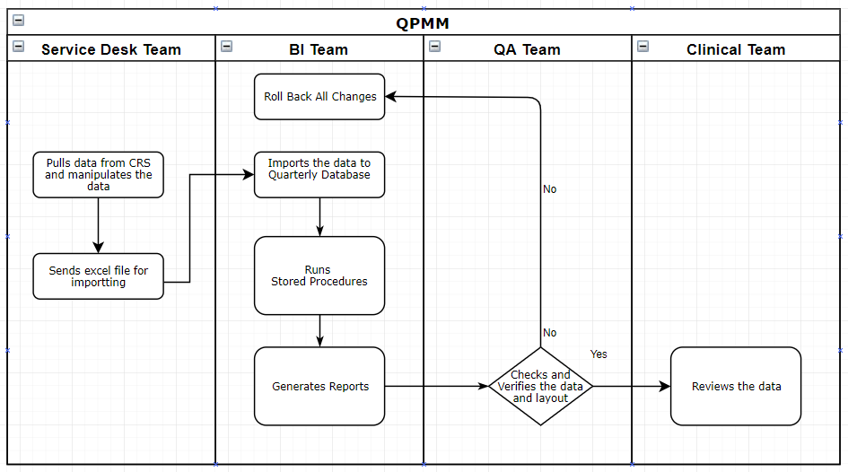

## Service Desk SOP

`Y:\SERVICE DESK\Policies & Procedures\Standard Operating Procedures\Reporting\CS08 - Quarterly Performance Measuremant and Management Data Extract.docx`

## Dev Team SOP

### A. Overview

|||
|---|--|
|Team|Business Intelligence (BI)|
|Purpose|Corhealth produces quarterly Quality Performance Measurement & Monitoring (QPMM) reports. These reports with all 19 advanced cardiac programs in Ontario to provide a platform for regular measuring and monitoring of quality metrics for cardiac care across the province. The goal of the QPMM Cycle is to ensure that patients receive high quality cardiac care regardless of where they live, and where they access care.|
|Scope|•	This document provides on how to execute the Quarterly QPMM package|
|Process Start|Quarterly on the 4th business day, Service Desk send the excel sheet with QPMM data|
|Process End|Reports are generated. |
|Frequency |Quarterly.|
|Performance Management| 	Reports creation 3h.|
|SOP/Process Owner/Approver|	Reports creation - Specialist, Application Service|
|Tools / Templates| Crystal Reports   SVN   Adobe Acrobat   SQL Management Studio|
|Definitions |Quality Performance Measurement & Monitoring (QPMM) reports. Excel cut - process of taking data from CRS Universe and putting that data In our database SVN - Subversion application for code holding|

### B.	Summary Flowchart

### C.	Detailed Work Instructions

**Process Trigger:** Quarterly on the 4th business day, Service Desk send the excel sheet with QPMM data 
**Responsible:** BI Team

#### C.1 Importing Data in the database		(1H)

|Step |Process Step Description|General Notes|
|--|--|--|
|Import data from Excel|Open SQL Server management Studio, Connect to Database **WTISCCNDB2**. Navigate and right click on **‘Quarterly_Reports’** **, Task / **‘Import Data..’**. Click Next, change data source to **‘Microsoft Excel Excel’**. Click Browse… and navigate and open the excel file given by Service desk. Click **‘Next’**. Select destination in the dropdown as **‘WTISCCNDB2’**, and database is **‘Quarterly Reports’**.  Click Next.  Select the following tables:  usp_CATH_Diseased_Program_Trend usp_PreCATH_Testing_Trend usp_STEMI_Facility_FMC90_Trend usp_STEMI_Facility_FHA120_Trend usp_STEMI_Facility_FHA120 usp_STEMI_Facility_FMC90 usp_CATH_Diseased_Program_Rank usp_CATH_PreCath_Testing_Rank STEMI_Facility_LTYIC30 ScoreCardCATH_STEMI  Click Next, Next, Select ‘Run Immediately’ and click ‘Finish’.|Must have db.owner access to Quarterly_Reports|
|Get latest script|Right click on your repository folder “C:\SOPExecution\QPMM” and click on SVN Update.||
|Move imported data to report tables|Navigate to SOP server folder “C:\SOPExecution\QPMM”, open following sql script  **QPMM Import from excel.sql**  Run this code in SQL Server Management tool in the Database **‘Quarterly Reports’** **. After running please check Message tab for any errors.||

#### C.2 Creating Reports		(40 mins)
|Step|Process Step Description|General Notes|
|--|--|--|
|Generate reports|Open Command Prompt.   Type the following: **cd  C:\SOPExecution\QPMM** Press enter on keyboard.  Type the following: **”C:\Program Files (x86)\IronPython 2.7\ipy.exe” GenerateQPMMReports.py** Press enter on keyboard.||
|Open local report folder|Check for the reports in the output in   **C:\SOPExecution\QPMM\yyyy\yyyy-mm-dd**.||
|Copy reports to Y drive|Copy all generated reports to destination Y drive folder ** **Y:\BI\Data Management\Reports\Quality Performance Measurement & Monitoring\CorHealth\YYYY\YYYY-MM-DD\Hospital QPMM Report Package**||

