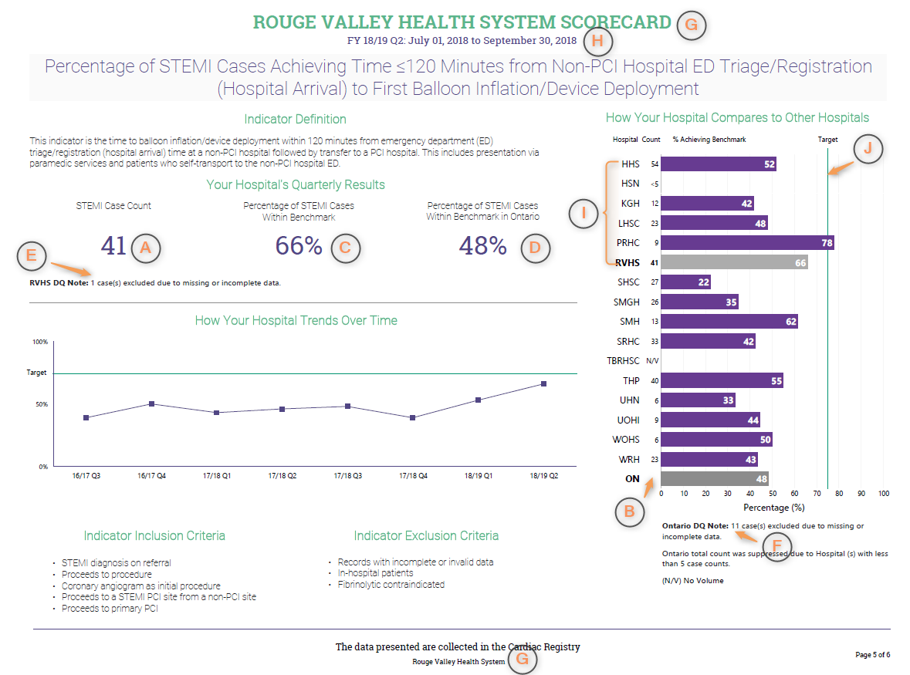

# Business Requirements

## Cardiac Scorecard Report

### Page 1: Elective CATHs where Coronary Artery Disease (CAD) was Identified

#### Report Page UI Layout

#### Metrics

| Data Element                         | UI Position | Description | Data Type | Aggregate Method | Dependency |
|--------------------------------------|-------------|-------------|-----------|------------------|------------|
| Cardiac Program Elective CATHs Count | A			 | Total count of valid Elective CATH cases at a specific Cardiac Program| int| Count of Quarterly Elective CATH cases exclude **CATHs DQ** count per Cardiac Program|[Elective CATHs Definition](cardiac-specification.md#elective-cath-case-definition)  [Elective CATHs - DQ Definition](cardiac-specification.md#elective-cath-case-data-quality)|
| Provincial Elective CATHs count  	   | B			 | Total count of valid Elective CATH cases at all the Cardiac Programs across the province|int| Provincial Count of Quarterly Elective CATH cases exclude **CATHs DQ** count||
|Cardiac Program Percentage of Elective CATH with CAD Identified | C		| Percentage of Elective CATH cases at a specific Cardiac Program were the  results indicated disease was found| %| Count of quarterly CATHs CAD count / row 1 * 100% per Cardica Program |[Elective CATHs - CAD Definition](cardiac-specification.md#3-disease-indicator)|
|Provincial Percentage of Elective CATH with CAD Identified | D			| Percentage of Elective CATH cases at all the Cardiac Programs across the province| %| Provincial Count of quarterly CATHs CAD count / row 2 * 100% ||
|Cardiac Program Elective CATH Data Quality Case Count| E 		| Total count of Elective CATH cases at a specific Cardiac Program where not enough information was provided to determine the result|int| Count of Quartly CATHs DQ count per Cadica Program|[Elective CATHs - DQ Definition](cardiac-specification.md#elective-cath-case-data-quality)|
|Provincial Elective CATH Data Quality Case Count| F		| Total count of Elective CATH cases  at all Cardiac Program across the province where not enough information was provided to determine the result|int| Provincial Count of Quartly CATHs DQ count||

#### Dynamic Labels on Report Page UI
| Data Element         | UI Position | Table Name | Column Name  | Join Conditions | Notes |
|----------------------|-------------|------------|--------------|-----------------|-------|
|Cardiac Program Name  | G		| Facility|FacilityName| Facility.FacilityNumber= FacilitySiteRel.FacilityNumber   FacilitySiteRel.SiteNumber = CardiacWaitListEntry.AcceptanceSiteNumber||
|From/To Date Range for latest Fiscal Year and Quater |	H		|Compute|From the date the report is generated||The quarter that report is genereted for|
|Cardiac Program Abbreviation| I		| Hard Coded In Excel Extract|||

#### Data Regions on Report
| Name | Metrics Involved | Data Scope | Group By | Order By | Notes |
|------|------------------|------------|----------|----------|-------|
|Your Hospital's Quarterly Results| A C D E F		| Data from latest Fiscal Year and Quarter for the Cardiac Program |||data's [Fiscal Year and Quarter](cardiac-specification.md#compute-columns-design) is based on RemovalDate|
|How Your Hospital Compares to Other Hospitals| A B C D 	| Data from latest Fiscial Year and Quarter for all all Cardic Programs| Cardiac Program Name | C - "Cardiac Program Percentage of Elective CATH with CAD Identified" from high to low. Insert 'Onatrio' data to corresponding position according to average percentage value|data's [Fiscal Year and Quarter](cardiac-specification.md#compute-columns-design) is based on RemovalDate|
|How Your Hospital Trends Over Time| A C		| Data from previous 8 quarters for the Cardiac Program| Fiscial Year and Quarter| Fiscial Year to Quarter |data's [Fiscal Year and Quarter](cardiac-specification.md#compute-columns-design) is based on RemovalDate|

### Page 2: Elective CATHs with Pre-CATH Functional Testing

#### Report Page UI Layout

#### Metrics
| Data Element | UI Position | Description | Data Type | Aggregate Method | Dependency |
|--------------|-------------|-------------|-----------|------------------|------------|
| Cardiac Program Elective CATHs Count |A 		|Total count of valid Elective CATH cases with Pre-CATH Functional Testing at a specific Cardiac Program | int| Count of Quarterly Elective CATH cases exclude **Pre-CATH DQ** count per Cardiac Program|[Elective CATHs Definition](cardiac-specification.md#elective-cath-case-definition)   [Non Invasive Testing Calculation ('Data Quality' Formula)](cardiac-specification.md#non-invasive-testing-calculation)|
| Provincial Elective CATHs count  | B 		| Total count of valid Elective CATH cases with Pre-CATH Functional Testing at all the Cardiac Programs across the province|int| Provincial Count of Quarterly Elective CATH cases exclude **Pre-CATH DQ** count||
|Cardiac Program Percentage of Pre-CATH Testing Performed| C			| Total count of Elective CATH cases with at least one Non-invasive test was done at a specific Cardiac Program divided by the total number of valid Elective CATH cases with Pre-CATH Functional Testing calculated as a percentage|%| Count of Pre-CATH Testing Performed Quarterly count / row 1 * 100% per Cardiac Program|[Non Invasive Testing Calculation ('Testing' Formula)](cardiac-specification.md#non-invasive-testing-calculation)|
|Percentage of Pre-CATH Testing Performed in Ontario| D			| Total of Elective CATH cases with at least one Non-invasive test was done at all Cardiac Programs across the province divided by the total number of valid Elective CATH cases with Pre-CATH Functional Testing calculated as a percentage|%| Provincial Count of Pre-CATH Testing Performed Quarterly count / row 1 * 100%||
|Cardiac Program Elective CATH cases with Pre-CATH Functional Testing Data Quality Count| E 		| Total count of Elective CATH cases with Pre-CATH Functional Testing Data Quality at a specific Cardiac Program|int| Count of Pre-CATH DQ Quarterly count per Cardiac Program|[Non Invasive Testing Calculation ('Data Quality' Formula)](cardiac-specification.md#non-invasive-testing-calculation)|
|Provincial Elective CATH cases with Pre-CATH Functional Testing Data Quality Count| F		| Total count of Elective CATH cases with Pre-CATH Functional Testing Data Quality at all Cardiac Programs across the province|int| Provincial Count of Pre-CATH DQ Quarterly count||

#### Dynamic Labels on Report Page UI
| Data Element | UI Position | Table Name | Column Name | Join Conditions | Notes |
|--------------|-------------|------------|-------------|-----------------|-------|
|Cardiac Program Name| G		| Facility|FacilityName| Facility.FacilityNumber= FacilitySiteRel.FacilityNumber   FacilitySiteRel.SiteNumber = CardiacWaitListEntry.AcceptanceSiteNumber||
|From/To Date Range for latest Fiscal Year and Quater | H 		| Compute|From the date the report is generated||The quarter that report is genereted for|
|Cardiac Program Abbreviation| I 		| Hard Coded In Excel Extract|||

#### Data Regions on Report
| Name                                          | Metrics Involved | Data Scope  | Group By| Order By|Notes|
|-----------------------------------------------|------------------|-------------|---------|---------|-----|
|Your Hospital's Quarterly Results				| A C D E F		   | Data from latest Fiscal Year and Quarter for the Cardiac Program |||data's [Fiscal Year and Quarter](cardiac-specification.md#compute-columns-design) is based on RemovalDate|
|How Your Hospital Compares to Other Hospitals  | A B C D 		   | Data from latest Fiscial Year and Quarter for all all Cardic Programs| Cardiac Program Name | C - "Cardiac Program Percentage of Pre-CATH Testing Performed" from high to low. Insert 'Onatrio' data to corresponding position according to average percentage value|data's [Fiscal Year and Quarter](cardiac-specification.md#compute-columns-design) is based on RemovalDate|
|How Your Hospital Trends Over Time				|A C			   | Data from previous 8 quarters for the Cardiac Program| Fiscial Year and Quarter| Fiscial Year to Quarter |data's [Fiscal Year and Quarter](cardiac-specification.md#compute-columns-design) is based on RemovalDate|

### Discoveries

???+ note "Discovery - Current Process Issues"
	* Cariac Program Abbreviation should read from CCN_Reference database CCN_Facility_Abbreviations table FacilityAbbreviations_1 column
	* For the trend chart on the report pages, since every quarter the report data is based on production data-cut, if hospital users change previous quarter's data via Wait Time application, the trend data on this quarter's report might not match trend data on previous quarter's report

???+ danger "Document - Missing Contents"

	* Specification Excel file doesn't mention the data count by Quarter
	* Pdf report use word 'Elective CATH case', the Specification Excel file uses word 'CATH case'
	* Specification Excel file has no clear statement about Metrics A and B if it should include CATH/Pre-CATH DQ count or not. It should exclude CATH/PreCATH DQ count which is a conclusion after reading current code
	* Specification Excel file uses the same words "Total count of CATH cases at a specific Cardiac Program" as report element definition, it's not accurate. On first two report pages, the count value are not always same even they have same Label "Elective CATH count", this is because that ( Elective CATH case count - CATH DQ count ) does not always equal to ( Elective CATH case count - Pre-CATH DQ count ).

## STEMI Scorecard Report

### Page 3: Percentage of STEMI Cases Presenting Directly to a PCI Hospital Achieving Time ≤90 Minutes

#### Report Page UI Layout

#### Metrics

| Data Element                                                      | UI Position |  Description | Data Type |Aggregate Method|Dependency|
|-------------------------------------------------------------------|-------------|------|---------------|------------------|--|
| Advance Program Center STEMI Case Count                           | A           |Total count of STEMI case that first reports to a PCI site and is first treated with a PPCI at specific Advance Program Center (Facility identified as an Advance Program Center) for patients that self-present to ED or patients who present via paramedic services|int| Count of Quarterly STEMI case that meets Balloon 90 PCI Indicator without checking Reperfusion Time within 90 minutes or not per Advance Program Center| [STEMI case definition](STEMI-specification.md#stemi-case-definition)  [Ballon 90 PCI Indicator](STEMI-specification.md#balloon-90-pci-indicator)|
| Provincial STEMI Case Count                                       | B           |Total count of STEMI case that first reports to a PCI site and is first treated with a PPCI in the province (All identified Advance Cardiac Centers) for patients that self-present to ED or patients who present via paramedic services|int| Provincial Count of Quarterly STEMI case that meets Balloon 90 PCI Indicator without checking Reperfusion Time within 90 minutes or not||
| Advance Program Center Percentage of STEMI Cases Within Benchmark | C           |Percentage of STEMI case that first reports to a PCI site and is first treated with a PPCI at a specific Advance Program Center (Facility identified as an Advance Program Center) that fall within the 90 minute benchmark for patients that self-present to ED or patients who present via paramedic services|% |Count of Quarterly STEMI case that meets Balloon 90 PCI Indicator /Row 1 * 100% per Advance Program Center|[STEMI case definition](STEMI-specification.md#stemi-case-definition)  [Ballon 90 PCI Indicator](STEMI-specification.md#balloon-90-pci-indicator)|
| Provincial Percentage of STEMI Cases Within Benchmark             | D           |Percentage of STEMI case that first reports to a PCI site and is first treated with a PPCI in the province (All identified Advance Cardiac Centers) that fall within the 90 minute benchmark for patients that self-present to ED or patients who present via paramedic services|% |Provincial Count of Quarterly STEMI case that meets Balloon 90 PCI Indicator / Row 2 * 100%||
| Advance Program Center DQ STEMI Case Count                        | E           |Total count of excluded STEMI cases that first reports to a PCI site and is first treated with a PPCI in a specific Advance Program Center (Facility identified as an Advance Program Center)|int|	Count of Quarterly STEMI cases with Grouping column value equals to **'PCI No Data'** per Advance Program Center| [STEMI case definition](STEMI-specification.md#stemi-case-definition)  [Group Calculation](STEMI-specification.md#2-grouping-calculation)|
| Provincial DQ STEMI Case Count                                    | F           |Total count of excluded STEMI cases that first reports to a PCI site and is first treated with a PPCI in the province(All identified Advance Cardiac Centers)|int| Provincial Count of Quarterly STEMI cases with Grouping column value equals to **'PCI No Data'**||
| KPI Target                                                        | J           |  Target value of KPI is 75%|%| ||

#### Dynamic Labels on Report Page UI
|Data Element| UI Position|Table Name|Column Name|Join Conditions|Notes|
|---|---|---|---|--|---|
|Cardiac Program Name|G|Facility|FacilityName| Facility.FacilityNumber= FacilitySiteRel.FacilityNumber   FacilitySiteRel.SiteNumber = CardiacWaitListEntry.AcceptanceSiteNumber||
|From/To Date Range for latest Fiscal Year and Quater |H|Compute|From the date the report is generated||The quarter that report is genereted for|
|Cardiac Program Abbreviation|I|Hard Coded In Excel Extract|||

#### Data Regions on Report
| Name | Metrics Involved | Data Scope | Group By| Order By|Notes|
|---|---|---|---|---|--|
|Your Hospital's Quarterly Results|A C D E F| Data from latest Fiscal Year and Quarter for the Advance Cardiac Program |||data's [Fiscal Year and Quarter](cardiac-specification.md#compute-columns-design) is based on RemovalDate|
|How Your Hospital Compares to Other Hospitals|A B C D J| Data from latest Fiscial Year and Quarter for all Advance Cardic Programs. If STEMI Case Count is 0, show 'N/V' as the count label, if STEMI Case Count < 5, show '< 5' as the count label. If any Cardiac Center has STEMI Case Count < 5, then metrics B would show empty on the report| Cardiac Program Name | Advance Cardiac Programs' abbrevation in alphabet order. Add 'Onatrio' data to end of the list|data's [Fiscal Year and Quarter](cardiac-specification.md#compute-columns-design) is based on RemovalDate|
|How Your Hospital Trends Over Time|A C| Data from previous 8 quarters for the Advance Cardiac Program| Fiscial Year and Quarter| Fiscial Year to Quarter |data's [Fiscal Year and Quarter](cardiac-specification.md#compute-columns-design) is based on RemovalDate|

### Page 4: Percentage of STEMI Cases Achieving Time ≤120 Minutes from Non-PCI Hospital ED Triage/Registration

#### Report Page UI Layout

#### Metrics

| Data Element |UI Position | Description | Data Type |Aggregate Method|Dependencies|
|--------------------------|-------|------|---------------|------------------|--|
|Advance Program Center STEMI Case Count|A|Total count of STEMI with a First balloon inflation/Device cases at specific Advance Program Center (Facility identified as an Advance Program Center) within benchmark for patients that self-present to ED and patients who present via paramedic services|int| Count of Quarterly STEMI case that meets Balloon Non-120 PCI Indicator without checking Reperfusion Time within 120 minutes or not per Advance Program Center| [STEMI case definition](STEMI-specification.md#stemi-case-definition)  [Balloon Non-120 PCI Indicator](STEMI-specification.md#balloon-non-120-pci-indicator)|
|Provincial STEMI Case Count|B|Total count of STEMI with a First balloon inflation/Device cases in the province (All identified Advance Cardiac Centers) within benchmark for patients that self-present to ED and patients who present via paramedic services|int| Provincial Count of Quarterly STEMI case that meets balloon Non 120 Indicator without checking Reperfusion Time within 120 minutes or not||
|Advance Program Center Percentage of STEMI Cases Within Benchmark|C|Total of valid STEMI with a First balloon inflation/Device cases at a specific Advance Program Center (Facility identified as an Advance Program Center) that fall within the 120 minute benchmark divided by the total number of valid STEMI with a First balloon inflation/Device cases at that Advance Program Center (Facility identified as an Advance Program Center) calculated as a percentage for patients that self-present to ED or patients who present via paramedic services|% |Count of Quarterly STEMI case that meets Balloon Non-120 PCI Indicator /Row 1 * 100% per Advance Program Center|[STEMI case definition](STEMI-specification.md#stemi-case-definition)  [Balloon Non-120 PCI Indicator](STEMI-specification.md#balloon-non-120-pci-indicator)|
|Provincial Percentage of STEMI Cases Within Benchmark|D|Percentage of STEMI with a First balloon inflation/Device cases in the province  (All identified Advance Cardiac Centers) that fall within the 120 minute benchmark for patients that self-present to ED or patients who present via paramedic services|% |Provincial Count of Quarterly STEMI case that meets Balloon Non-120 PCI Indicator / Row 2 * 100%||
|Advance Program Center DQ STEMI Case Count|E|Total count of excluded STEMI with a First balloon inflation/Device case count in a specific Advance Program Center (Facility identified as an Advance Program Center)|int|	Count of Quarterly STEMI case with Grouping column value equals **'Non-PCI No Data'** per Advance Program Center| [STEMI case definition](STEMI-specification.md#stemi-case-definition)  [Group Calculation](STEMI-specification.md##2-grouping-calculation)|
|Provincial DQ STEMI Case Count|F|Total count of excluded STEMI with a First balloon inflation/Device case count in the province(All identified Advance Cardiac Centers)|int| Provincial Count of Quarterly STEMI case with Grouping column value equals **'Non-PCI No Data'**||
|KPI Target|J| Target value of KPI is 75%|%| ||

#### Dynamic Labels on Report Page UI
|Data Element| UI Position|Table Name|Column Name|Join Conditions|Notes|
|---|---|---|---|--|---|
|Cardiac Program Name|G|Facility|FacilityName| Facility.FacilityNumber= FacilitySiteRel.FacilityNumber   FacilitySiteRel.SiteNumber = CardiacWaitListEntry.AcceptanceSiteNumber||
|From/To Date Range for latest Fiscal Year and Quater |H|Compute|From the date the report is generated||The quarter that report is genereted for|
|Cardiac Program Abbreviation|I|Hard Coded In Excel Extract|||

#### Data Regions on Report
| Name | Metrics Involved | Data Scope | Group By| Order By|Notes|
|---|---|---|---|---|--|
|Your Hospital's Quarterly Results|A C D E F| Data from latest Fiscal Year and Quarter for the Advance Cardiac Program |||data's [Fiscal Year and Quarter](cardiac-specification.md#compute-columns-design) is based on RemovalDate|
|How Your Hospital Compares to Other Hospitals|A B C D J| Data from latest Fiscial Year and Quarter for all Advance Cardic Programs. If STEMI Case Count is 0, show 'N/V' as the count label, if STEMI Case Count < 5, show '< 5' as the count label. If any Cardiac Center has STEMI Case Count < 5, then metrics B would show empty on the report| Cardiac Program Name | Advance Cardiac Programs' abbrevation in alphabet order. Add 'Onatrio' data to end of the list|data's [Fiscal Year and Quarter](cardiac-specification.md#compute-columns-design) is based on RemovalDate|
|How Your Hospital Trends Over Time|A C| Data from previous 8 quarters for the Advance Cardiac Program| Fiscial Year and Quarter| Fiscial Year to Quarter |data's [Fiscal Year and Quarter](cardiac-specification.md#compute-columns-design) is based on RemovalDate|

### Page 5: Appendix A Percentage of STEMI Cases Achieving Time ≤30 Minutes to Fibrinolytic Administration

#### Report Page UI Layouts

#### Metrics

| Data Element |UI Position | Description | Data Type |Aggregate Method|Dependencies|
|--------------------------|-------|------|---------------|------------------|--|
|Lytic site STEMI with Fibrinolytic Administration case percentage within 30 min|A|Percentage of STEMI with Fibrinolytic Administration cases for the Advance Cardiac Program that fall within the 30 minute benchmark for patients that self-present to ED and  patients who present via paramedic services | %| Count of Quarterly STEMI case that meets Lytic 30 Indicator /  Count of Quarterly Lytic STEMI case (Data Qaulity records are excluded) * 100% per site| [Lytic 30 Indicator](STEMI-specification.md#fibrinolytic-30-indicator)  [Lytic Grouping](STEMI-specification.md#4-lytic-grouping-calculation) when value is 'Lytic'|
|Provincial Lytic STEMI with Fibrinolytic Administration case percentage within 30 min|B|Percentage of STEMI with Fibrinolytic Administration cases in the province  (All identified Advance Cardiac Centers)  that fall within the 30 minute benchmark for patients that self-present to ED and  patients who present via paramedic services|%| Provincial Count of Quarterly STEMI case that meets Lytic 30 Indicator /  Count of Quarterly Lytic STEMI case (Data Qaulity records are excluded) * 100% } ||
|KPI Target|F| Target value of KPI is 75%|%| ||

#### Dynamic Labels on Report Page UI
|Data Element| UI Position|Table Name|Column Name|Join Conditions|Notes|
|---|---|---|---|--|---|
|Hosptial Name|C|Compute|Lytic Site Name| |see [Lytic Site Calculation](STEMI-specification.md#6-lytic-site-calculation) for details|
|Cardiac Program Name|G|Facility|FacilityName| Facility.FacilityNumber= FacilitySiteRel.FacilityNumber   FacilitySiteRel.SiteNumber = CardiacWaitListEntry.AcceptanceSiteNumber||
|From/To Date Range for latest Fiscal Year and Quater |H|Compute|From the date the report is generated||The quarter that report is genereted for|

#### Data Regions on Report
| Name | Metrics Involved | Data Scope | Group By| Order By|Notes|
|---|---|---|---|---|--|
|Percentage of STEMI Cases Achieving Time ≤30 Minutes to Fibrinolytic Administration|A B E| Data from latest Fiscal Year and Quarter the Advance Cardiac Program |Hospital Names of the Avance Cardiac Program See [Lytic Site Calulatiton](STEMI-specification.md#6-lytic-site-calculation) for details|Percentage (Metrics A) hight to low. If the hosptial has no data, don't show the hospital name on the report. Add 'Onatrio' data to end of the list |data's [Fiscal Year and Quarter](cardiac-specification.md#compute-columns-design) is based on RemovalDate|

### Discoveries

???+ note "Discovery - Current Process Issues"
	* Page 5: There are manually data filtering and extra rows deletion steps to prepare Lytic Calculated data. Please see Step 2.4 in **Y:\SERVICE DESK\Policies & Procedures\Standard Operating Procedures\Reporting\CS08 - Quarterly Performance Measuremant and Management Data Extract.docx**

???+ danger "Document - Misleading Contents"

	* Specification Excel file doesn't mention the data count by Quarter
	* Specification Excel file uses "Total count of excluded STEMI with a First balloon inflation/Device case count ..." in all aggreate columns on Page 3 and Page 4, it's very misleading that the STEMI cases Total Count is same thing on Page 3 and page 4. But acutally they are not.
	* Specificaiton Excel file has too many aggreate columns that not showing on the report page.
	* Page 3 and 4: The description column content should be more accturate to describe it's for Non-PCI and PPCI STEMI cases

## Minimum Data Columns Required

 **Server:** WTISCCNDB2
 **Database:** WCPRDDB1

| Data Element                         | Table Name               | Column Name                                   | Column Nullable?    | Column Type   | Display On Report? |Pages Involved | Definition| Calculation Involved|
|--------------------------------------|--------------------------|-----------------------------------------------|---------------------|---------------|--------------------|----------|------------|-------------|
| CATH case Id (Entry Id)              | CardiacWaitListEntry     | WaitlistEntryID                               | Not Null            | numeric(18,0) | No                 | All     | | |
| Planned Service Location Id (Site Id) | CardiacWaitListEntry     | AcceptanceSiteNumber                          | Null (no null data) | numeric(18,0) | No                 | All     | Id of the hospital where the procedure will be completed. | Site must within [Cardica Program Centers List](data-transformation.md#cardiac-program-centers-list)|
| Planned Service Location (Site Name)  | Site                     | SiteName                                      | Not Null            | varchar(50)   | No                 | All     | The hospital where the procedure will be completed.||
| Cardiac Program Name (Facility Name) | Facility                 | FacilityName                                  | Not Null            | varchar(50)   | **Yes**            | All     | Facility Name where cardiac services are provided||
| Facility Number                      | Facility                 | FacilityNumber  (join via FacilitySiteRel) | Not Null            | numeric(18,0) | No                 | All     | Facility Number where a site is associated to |[Cardica Program Centers List](data-transformation.md#cardiac-program-centers-list)  [Elective CATH case Definition](cardiac-specification.md#elective-cath-case-definition)  [STEMI case Defintion](STEMI-specification.md#stemi-case-definition)|
| Removal Date                         | CardiacWaitListEntry     | RemovalDate                                   | Null                | datetime      | No                 | All     | Date the patient was removed from the active wait list which is usually equivalent to procedure date.|Fiscal year and Quarter|
| Wait Time Procedure Code             | CardiacWaitListEntry     | WaitTimeProcedureCD                           | Not Null             | char(19)   | No                 | All| The service category associated with the cardiac procedure for the current wait list entry. This will be automatically determined based on user access rights.|[Elective CATH case Definition](cardiac-specification.md#elective-cath-case-definition)  [STEMI case Definition](STEMI-specification.md#stemi-case-definition)|
| Removal Reason                       | CardiacWaitListEntry     | RemovalReasonCD                               | Null               | varchar(5)     | No                | All| Reason the patient was removed from the active wait list.|[Elective CATH case Definition](cardiac-specification.md#elective-cath-case-definition)  [STEMI case Definition](STEMI-specification.md#stemi-case-definition)|
| Priority Level                       | CardiacWaitListEntry     | PriorityLevelCD                               | Null               | char(4)      | No                | Page 1, 2| The patient priority at the time of event which is calculated based on the patient's urgency rating score (URS).|[Elective CATH case Definition](cardiac-specification.md#elective-cath-case-definition)|
| Primary Reason for Referral          | CardiacReferral          | ReferralPrimaryReasonCD                       | Null               | char(1)      | No                | All| The principal reason for the procedure referral. |[Elective CATH case Definition](cardiac-specification.md#elective-cath-case-definition)  [STEMI case Definition](STEMI-specification.md#stemi-case-definition)|
| Coronary Angiogram Indicator    | CardiacOfflistingDetails | Cath_CoronaryAngiogramIND                     | Null(_Y/N only_)   | char(1)      | No                | Page 1, 2| Coronary angiogram is the selective injection of x-ray contrast into one or more coronary arteries or coronary bypass graft to visualize the lumen of coronary arteries.|[Elective CATH case Definition](cardiac-specification.md#elective-cath-case-definition)|
| Is Active                            | WaitlistEntryBooking     | IsActive                                      | Null(_Y/N only_)   | bit          | No                | Page 1, 2| |[Elective CATH case Definition](cardiac-specification.md#elective-cath-case-definition)|
| Primary Reason for Referral - Type   | CardiacReferral          | ReferralPrimaryReasonTypeCD                   | Null               | char(4)      | No                | All|The clinical presentation as it relates to the primary reason for referral. |[Elective CATH case Definition](cardiac-specification.md#elective-cath-case-definition)  [STEMI case Definition](STEMI-specification.md#stemi-case-definition)|
| Previous CABG Procedure Code         | CardiacReferral          | Cath_PreviousCabgProcedureCD                  | Null               | char(1)      | No                | Page 1, 2|Documented history of previous coronary artery bypass graft (CABG) surgery. |[Elective CATH case Definition](cardiac-specification.md#elective-cath-case-definition)|
| Diagnostic Procedure Aborted Indicator  | CardiacOfflistingDetails | Cath_DiagnosticProcedureAbortedIND    | Null(_Y/N only_)   | char(1)      | No                | Page 1, 2| An aborted diagnostic procedure e.g., coronary angiogram, is one in which the skin has been punctured with the intent to perform a coronary angiogram but the procedure has been abandoned prior to injection of contrast media into the coronary arteries with no coronary artery visualized. |[Elective CATH case Definition](cardiac-specification.md#elective-cath-case-definition)|
| Referral Wait Location               | CardiacReferral          | SiteNumber                                    | Null                | numeric(18,0) | No                 | Page 1, 2| Location of patient at time of referral.|[Home Formula](cardiac-specification.md#home-site-calculation)|
| Patient Wait Location at Acceptance  | CardiacWaitListEntry     | PatientWaitSiteNumber                         | Null                | numeric(18,0) | No                 | Page 1, 2| Location of patient at time of acceptance for procedure.  |[Home Formula](cardiac-specification.md#home-site-calculation)|
| If Patient Wait Location Different from Acceptance Location - Details | WaitlistEntryBooking     | PatientWaitSiteNumberOther                    | Null                | numeric(18,0) | No                 | Page 1, 2| Details of patient wait location for procedure at time of booking if different from Acceptance Location.|[Home Formula](cardiac-specification.md#home-site-calculation)|
| Native Stenosis - Normal Anatomy     | CardiacOfflistingDetails | Cath_NormalAnatomyIND                         | Not Null            | char(1)       | No                 | Page 1   | Results of current or most recent coronary angiogram indicating absence of flow limiting atherosclerosis i.e., stenosis in the native artery (i.e., non-graft).|[Cardiac CATH Indicator](cardiac-specification.md#cardiac-cath-indicators) / [DQ Formula](cardiac-specification.md#home-site-calculation) |
| Native Stenosis - Non Significant CAD | CardiacOfflistingDetails | Cath_NonSignificantCADIND                     | Not Null            | char(1)       | No                 | Page 1   | Results of current or most recent coronary angiogram indicate presence of atherosclerotic disease with <50% stenosis in left main and <70% stenosis in other coronary vessels (i.e., non-graft).|[Cardiac CATH Indicator](cardiac-specification.md#cardiac-cath-indicators) / [DQ Formula](cardiac-specification.md#home-site-calculation) |
| Native Stenosis - LM                 | CardiacOfflistingDetails | Cath_NativeLmCD                               | Null                | char(1)       | No                 | Page 1   | Stenosis or blockage greater than or equal to 50% of the native left main (LM) artery based on current or most recent coronary angiogram.|[Cardiac CATH Indicator](cardiac-specification.md#cardiac-cath-indicators) / [DQ Formula](cardiac-specification.md#home-site-calculation) |
| Native Stenosis - Prox LAD           | CardiacOfflistingDetails | Cath_NativeProxLadCD                          | Null                | char(1)       | No                 | Page 1   | Stenosis of native proximal left anterior descending (LAD) artery in the segment before any branch (i.e., diagonal) of the LAD, based on current or most recent coronary angiogram.|[Cardiac CATH Indicator](cardiac-specification.md#cardiac-cath-indicators) / [DQ Formula](cardiac-specification.md#home-site-calculation) |
| Native Stenosis - Mid/Distal LAD     | CardiacOfflistingDetails | Cath_NativeMidDistalLadCD                     | Null                | char(1)       | No                 | Page 1   |Stenosis of native mid/distal left anterior descending (LAD) artery in the segment beyond the first branch (i.e., diagonal) of the LAD, based on current or most recent coronary angiogram.  |[Cardiac CATH Indicator](cardiac-specification.md#cardiac-cath-indicators) / [DQ Formula](cardiac-specification.md#home-site-calculation) |
| Native Stenosis - Circumflex          | CardiacOfflistingDetails | Cath_NativeCircumflexCD                       | Null                | char(1)       | No                 | Page 1   |Stenosis of native circumflex and any branches (including ramus and obtuse marginal branches), based on current or most recent coronary angiogram. |[Cardiac CATH Indicator](cardiac-specification.md#cardiac-cath-indicators) / [DQ Formula](cardiac-specification.md#home-site-calculation) |
| Native Stenosis - RCA                | CardiacOfflistingDetails | Cath_NativeRcaCD                              | Null                | char(1)       | No                 | Page 1   | Stenosis of right coronary artery (RCA) and any branches, based on current or most recent coronary angiogram. |[Cardiac CATH Indicator](cardiac-specification.md#cardiac-cath-indicators) / [DQ Formula](cardiac-specification.md#home-site-calculation) |
| Exercise ECG Done                    | CardiacReferral          | Cath_ExerciseEcgDoneCD                        | Null                | char(1)       | No                 | Page 2   | Exercise electrocardiogram (ECG) is performed prior to procedure. Exercise ECG is a non-invasive cardiac testing that records cardiac electrical activity to detect ischemic changes on an ECG during exercise (i.e., walking on treadmill or pedaling a stationary bike).|[Non Invasive Testing Formula](cardiac-specification.md#non-invasive-testing-calculation) |
| Functional Imaging Done              | CardiacReferral          | Cath_FunctionalImagingDoneCD                  | Null                | char(1)       | No                 | Page 2   | Functional imaging includes the combination of exercise or pharmacological stress (either dipyridamole/Persantine or adenosine or dobutamine/Dobutrex) with either 1) nuclear/PET perfusion imaging (thallium, MIBI or rubidium) 2) nuclear ventriculography (MUGA); or 3) echocardiography.|[Non Invasive Testing Formula](cardiac-specification.md#non-invasive-testing-calculation) |
| LHIN Name                               | LHIN                     | LHINName (Join via LHINFacilityRel)     | Not Null          | varchar(50)     | No                 | | |
| Non-PCI Hospital Id                     | CardiacStemiActivity     | PP_NonPCISiteNumber                        | Null              | numeric(18,0)   | No                 | Page 3, 4   | The Id of the non-PCI hospital the patient presented at or transferred to. ||
| Non-PCI Hospital Name                   | Site                     | SiteName                                   | Not Null          | varchar(50)     | No                 |             |The name of the non-PCI hospital the patient presented at or transferred to.||
| Ambulance                               | CardiacStemiActivity     | PPAmbulance_IND                            | Null (_Y/N only_) | char(1)         | No                 | Page 3, 4, 5|Patient was transported by ambulance to the nearest emergency department (ED) or percutaneous coronary intervention (PCI) hospital. |[Balloon 90 PCI Indicator](STEMI-specification.md#balloon-90-pci-indicator)  [Balloon Non-120 PCI Indicator](STEMI-specification.md#balloon-non-120-pci-indicator)  [Fibrinolytic 30 Indicator](STEMI-specification.md#fibrinolytic-30-indicator)|
| Ambulance - Direct Field to Cath Lab    | CardiacStemiActivity     | PPDirectFieldToCath_IND                    | Null (_Y/N only_) | char(1)         | No                 | Page 3, 4. 5  | Patient was transported directly from the field to the cath lab in a percutaneous coronary intervention (PCI) hospital bypassing the emergency department (ED).|[Balloon 90 PCI Indicator](STEMI-specification.md#balloon-90-pci-indicator)  [Balloon Non-120 PCI Indicator](STEMI-specification.md#balloon-non-120-pci-indicator)  [Fibrinolytic 30 Indicator](STEMI-specification.md#fibrinolytic-30-indicator)|
| Ambulance - Field to ED of PCI Hospital | CardiacStemiActivity     | PPFieldToEDPCIHospital_IND                | Null (_Y/N only_) | char(1)         | No                 | Page 3, 4   |Patient was transported directly from the field by ambulance to the emergency department (ED) of PCI hospital.|[Balloon 90 PCI Indicator](STEMI-specification.md#balloon-90-pci-indicator)  [Balloon Non-120 PCI Indicator](STEMI-specification.md#balloon-non-120-pci-indicator)|
| Ambulance - Field to ED of Non-PCI Hospital| CardiacStemiActivity     | PPFieldToEDNonPCIHospital_IND             | Null (_Y/N only_) | char(1)         | No                 | Page 3, 4, 5   |Patient was transported directly from the field by ambulance to the emergency department (ED) of a non-PCI hospital.|[Balloon 90 PCI Indicator](STEMI-specification.md#balloon-90-pci-indicator)  [Balloon Non-120 PCI Indicator](STEMI-specification.md#balloon-non-120-pci-indicator)  [Fibrinolytic 30 Indicator](STEMI-specification.md#fibrinolytic-30-indicator)|
| Self-Transport                          | CardiacStemiActivity     | PPSelfTransport_IND                       | Null (_Y/N only_) | char(1)         | No                 | Page 3, 4 ,5  |Patient presented at emergency department (ED) through self transport or via other non-911 means. |[Balloon 90 PCI Indicator](STEMI-specification.md#balloon-90-pci-indicator)  [Balloon Non-120 PCI Indicator](STEMI-specification.md#balloon-non-120-pci-indicator)  [Fibrinolytic 30 Indicator](STEMI-specification.md#fibrinolytic-30-indicator)|
| Self-Transport to PCI Hospital          | CardiacStemiActivity     | PPSelfTransportToPCIHospital_IND          | Null (_Y/N only_) | char(1)         | No                 | Page 3, 4     |Patient presented at emergency department (ED) of a PCI hospital via self transport or other non-911 means. |[Balloon 90 PCI Indicator](STEMI-specification.md#balloon-90-pci-indicator)  [Balloon Non-120 PCI Indicator](STEMI-specification.md#balloon-non-120-pci-indicator)|
| Self-Transport to Non-PCI Hospital      | CardiacStemiActivity     | PPSelfTransportToNonPCIHospital_IND       | Null (_Y/N only_) | char(1)         | No                 | Page 3, 4, 5   | Patient presented to emergency department (ED) of a non-PCI hospital via self transport or other non-911 means. |[Balloon 90 PCI Indicator](STEMI-specification.md#balloon-90-pci-indicator)  [Balloon Non-120 PCI Indicator](STEMI-specification.md#balloon-non-120-pci-indicator)  [Fibrinolytic 30 Indicator](STEMI-specification.md#fibrinolytic-30-indicator)|
| In-Hospital Patient                     | CardiacStemiActivity     | PPInHospitalPatient_IND                   | Null (_Y/N only_) | char(1)         | No                 | Page 3, 4   |Patient was an inpatient at the treating hospital. |[STEMI case Definition](STEMI-specification.md#stemi-case-definition) |
| PPCI                                    | CardiacOfflistingDetails | Cath_ProcedureDonePrimaryReperfusionIND   | Not Null          | char(1)         | No                 | Page 3, 4   |The use of percutaneous coronary intervention (PCI) as the initial mode of reperfusion with STEMI up to 24 hours from symptom onset. This type of PCI is called primary PCI.|[Balloon 90 PCI Indicator](STEMI-specification.md#balloon-90-pci-indicator)  [Balloon Non-120 PCI Indicator](STEMI-specification.md#balloon-non-120-pci-indicator)|
| Fibrinolysis Administered               | CardiacStemiActivity     | FibrinolysisAdministered_CD               | Null (Y,N,F,Null) | char(1)         | No                 | Page 3, 4, 5| Fibrinolysis was administered to the STEMI patient.|[Balloon 90 PCI Indicator](STEMI-specification.md#balloon-90-pci-indicator)  [Balloon Non-120 PCI Indicator](STEMI-specification.md#balloon-non-120-pci-indicator)  [Fibrinolytic 30 Indicator](STEMI-specification.md#fibrinolytic-30-indicator) |
| First Contact with Paramedics - DateTime  | CardiacStemiActivity     | FirstContactParamedics_Date FirstContactParamedics_Time If any colum is null value, then merged value is null     | Null              | date time(7) | No  |Page 3, 4   | DateTime paramedics initially had contact with the STEMI patient |[Balloon 90 PCI Indicator](STEMI-specification.md#balloon-90-pci-indicator) |
| Ambulance ECG - Date                      | CardiacStemiActivity     | AmbulanceECG_Date                         | Null              | date            |                    |    |Date of first 12-lead ECG taken by paramedics or EMS. Note that it may not necessarily be the diagnostic ECG for STEMI as it may not always meet the criteria for STEMI.||
| Ambulance ECG - Time                      | CardiacStemiActivity     | AmbulanceECG_Time                         | Null              | time(7)         |                    |    |Time of first 12-lead ECG taken by paramedics or EMS. Note that it may not necessarily be the diagnostic 12-lead ECG for STEMI as it may not always meet the criteria for STEMI.||
| First Hospital Arrival - DateTime         | CardiacStemiActivity     | FirstHospitalArrival_Date FirstHospitalArrival_Time If any colum is null value, then merged value is null         | Null              | date time(7) | No | Page 3, 4, 5   | Date the paramedics or EMS (i.e., ambulance) arrived at the hospital as documented on the ambulance record or the date the patient initially arrived at the hospital as documented on the patient's chart. | [Balloon 90 PCI Indicator](STEMI-specification.md#balloon-90-pci-indicator)  [Balloon Non-120 PCI Indicator](STEMI-specification.md#balloon-non-120-pci-indicator)  [Fibrinolytic 30 Indicator](STEMI-specification.md#fibrinolytic-30-indicator)|
| First Hospital ECG - Date                 | CardiacStemiActivity     | FirstHospitalECG_Date                     | Null              | date            |                    |    |Date of first 12-lead ECG acquired in the hospital. Note that it may not be necessarily the diagnostic ECG for STEMI as it may not always meet the criteria for STEMI.||
| First Hospital ECG - Time                 | CardiacStemiActivity     | FirstHospitalECG_Time                     | Null              | time(7)         |                    |    |The time of first 12-lead ECG acquired in the hospital. Note that it may not be necessarily the diagnostic ECG for STEMI as it may not always meet the criteria for STEMI.||
| Fibrinolysis Given - DateTime             | CardiacStemiActivity     | InitialTherapy_DateGiven_Date InitialTherapy_DateGiven_Time If any colum is null value, then merged value is null | Null              | date time(7) | No | Page 5|Date that the fibrinolysis was administered.|[Fibrinolytic 30 Indicator](STEMI-specification.md#fibrinolytic-30-indicator)|
| Qualifying ECG - DateTime                 | CardiacStemiActivity     | QualifyingECG_Date QualifyingECG_Time If any colum is null value,then merged value is null                        | Null              | date time(7) | No ||DateTime of acquisition for the qualifying 12-lead ECG that confirmed the STEMI diagnosis.||                                                                                     |
| First Balloon Inflation/Device - DateTime | CardiacStemiActivity     | FirstBalloonInflation_Date FirstBalloonInflation_Time If any colum is null value,then merged value is null        | Null              | date time(7) | No |Page 3, 4   | DateTime of the first procedure (i.e., balloon inflation, wire insertion, thrombectomy, or stent implantation) that resulted in reperfusion as documented in the patient's cath lab record. |[Balloon 90 PCI Indicator](STEMI-specification.md#balloon-90-pci-indicator)  [Balloon Non-120 PCI Indicator](STEMI-specification.md#balloon-non-120-pci-indicator)|

